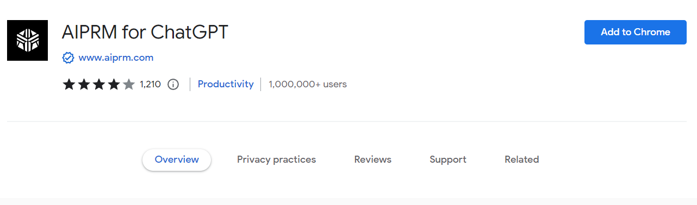
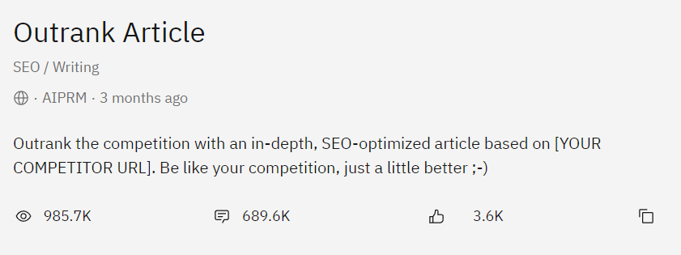
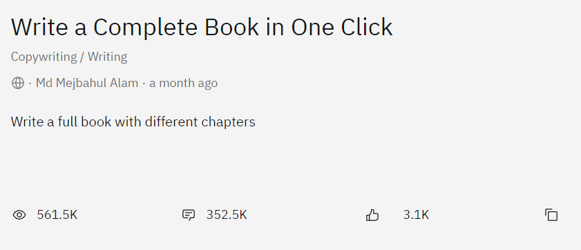
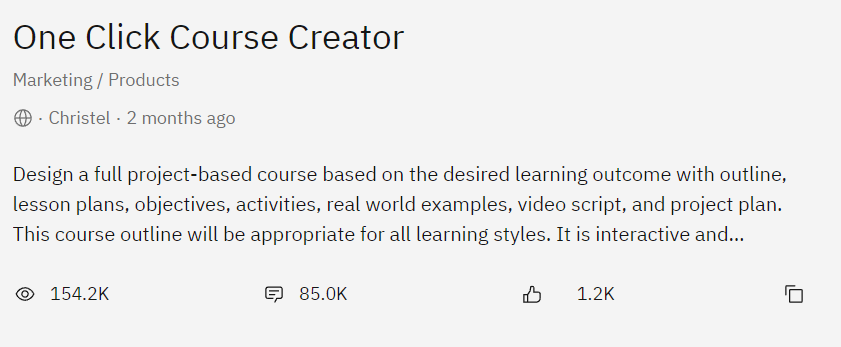

# AIPRM - The Only ChatGPT Extension You'll Need 😎🚀

AIPRM adds a list of curated prompt templates for SEO, SaaS
and more to ChatGPT.💻💡

Basically, it is a giant compilation of the best prompts.🔝
I'm giving AIPRM for ChatGPT it's own chapter - that should
tell you enough!📖💁‍

### Let's get into it:💪🔍

Add "AIPRM for ChatGPT" as a Chrome Extension🌐

  

Follow all the download instructions, and let's move onto
the content!📥📄

AIPRM adds a list of curated prompt templates for SEO, SaaS
and more to ChatGPT
When I'm creating this, there are currently 2800+ prompts
to use with ChatGPT - let's check out the best!🤩🙌

# Best AIPRM Prompts👍🔝

### 1. Outrank Competitor's Article🔝🏆

  

Easily my favorite prompt on the extension, this tool is LEGIT!💯

Simply paste the URL of a competitor blog post into the prompt, and it will create a new blog post with more keywords, value and higher search ranking.🔍📈💡

### 2. Write a Complete Book in One Click📚💻

  

#### Wait, wait, wait...!!!
You mean I can create a FULL book by only typing in the topic I'm looking for?🤯💥

### 3. One Click Course Creator📝🎓

  

If you are creating a course, project, or outline, I STRONGLY suggest using the One Click Course Creator. Even if you have everything planned out, it never hurts to get extra inspiration!!!🤓💡

#### Okay!!!

I am not going to spend much longer on this chapter, so I will attach a list of my favorite prompts below.🔽👇

#### Check them all out in your free time!

###### 4. E-Commerce SEO: Generate Product Descriptions!🛒📈
###### 5. Rewrite Article | Keyword-Rich Content📝🔍
###### 6. Audit Page Content for SEO [2.1.0]📊🔍
###### 7. 30 Social Media Posts & Image Suggestions With 1 Click📱📸🔝
###### 8. Code Generator💻👨‍💻
###### 9. Keyword Generator🔍📈
###### 10. Optimize Your Google Business Profile (GMB)🌐🔍👨💼
###### 11. Midjourney V5 prompts - 6 different styles📝🔝
###### 12. Written SEO Article | 100% Human Content Score📝💯
###### 13. Local SEO Master Plan Generator🌐📈

### General Tips:

Test, test, test!!!🧪👨🔬

🌡️Play with the temperature of your prompts  
📚Give more context than needed  
💡Give examples of what you are looking for  
🕵️‍♂️Use prompts to avoid AI detection*

## Handy Expressions💭↩🧑‍🏫🎭

    Let's think step by step
#### This makes the AI think logically and can be specifically helpful with math problems.
    Thinking backwards
#### This can help if the AI keeps arriving at inaccurate conclusions.
    In the style of [famous person]
#### This will help match styles really well.
    As a [insert profession/role]
#### This helps frame the bot's knowledge, so it knows what it knows—and what it doesn't.
